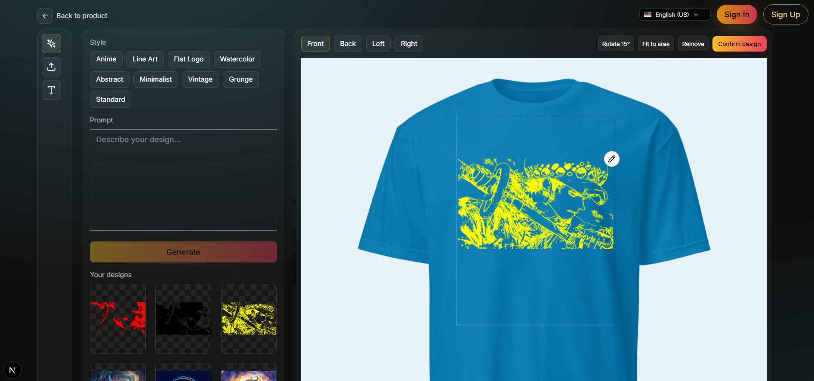

# TenkaiGen (Work in Progress)

Interactive print-on-demand designer with AI prompt parsing, direct Gemini image generation, background removal/post-processing, and Supabase-powered storage/auth. The UI includes a canvas-based product preview, design stack, and an in-place editor with AI edits, filters, and adjustable background removal.

## Stack
- Next.js (App Router), React, TypeScript
- Supabase (auth, jobs table), Backblaze B2 (S3-compatible storage)
- Google Gemini (direct generation) via `GEMINI_GENAI_API_KEY`
- Sharp for background removal and post-processing

## Key Features (current)
- Prompt parser (`/api/parse-prompt`) produces expanded prompt + 3 variants.
- Direct image generation (`/api/generate`) – batch is disabled.
- Design list with hover actions (add, edit, delete), edit modal with AI edit, filters, background removal, apply/reset/reset-to-original.
- Background removal (`/api/images/remove-bg`) with tolerance slider; post-process (`/api/images/postprocess`) for adjustments/filters.
- Product canvas with drag, wheel-zoom, and corner resize handles; responsive layout with mobile tools toggle.

## Getting Started
1. Install: `npm install`
2. Env: create `.env.local` with B2 + Supabase + Gemini keys (see `.env.example` if present).
3. Run dev: `npm run dev`

## Important Env Vars
- `GEMINI_GENAI_API_KEY` (required)
- `B2_S3_ENDPOINT`, `B2_S3_REGION`, `B2_S3_BUCKET`, `B2_S3_ACCESS_KEY_ID`, `B2_S3_SECRET_ACCESS_KEY`
- `SUPABASE_URL`, `SUPABASE_ANON_KEY`

## API Routes (selected)
- `POST /api/parse-prompt` – expanded prompt + 3 variants
- `POST /api/generate` – direct generation, uploads to B2
- `GET /api/generate/status/[jobId]` – job polling
- `POST /api/designs/delete` – delete from B2
- `POST /api/images/remove-bg` – white-to-alpha with threshold
- `POST /api/images/postprocess` – filters/adjustments/crop/rotate/flip

## Frontend Highlights
- `components/designer-page.tsx`: canvas, tools toggle, design stack, edit modal, corner resizing.
- `components/flow-provider.tsx`: global prompt/style/variants state.
- `components/hero.tsx`, `components/flow/prompt-client.tsx`: prompt capture and generation kickoff.

## Pending / Roadmap
- Payments & billing: Stripe integration (products, checkout, subscriptions).
- Auth polish: gated flows, user library persistence, saved edits.
- Persistence of edited variants (save-as-new) and history.
- Batch generation (if revisited) with robust status UX.
- Uploads/text tools completion; mobile UX polish and accessibility pass.
- Tests/QA coverage and error reporting.

## Screenshots
Images are located in `data/screenshots/`:
- Landing page hero with prompt input  
  
  - Catalog grid with filters and country selector  
  
- Product detail page with mockup selector and “Start designing” CTA  
  
- Designer canvas with tools, prompt panel, and applied design  
  

